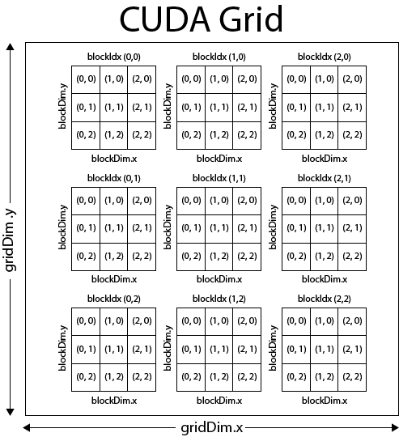

# Build with CMake
```bash
mkdir build
cd build
cmake ..
make
```

# hello_world.cu
## CUDA Thread and Block Indices



CUDA organizes threads into blocks, forming a grid. Each thread and block has a unique index.

### Thread Indices

- Threads are organized into a grid.
- Each thread has a unique `(x, y, z)` index within the grid.
- Accessed using `threadIdx.x`, `threadIdx.y`, `threadIdx.z`.

### Block Indices

- Blocks are grouped within the grid.
- Each block has a unique `(x, y, z)` index within the grid.
- Accessed using `blockIdx.x`, `blockIdx.y`, `blockIdx.z`.

### Total Thread Indices

- To calculate the global index of a thread within the grid:

```C++
int idx = threadIdx.x + blockIdx.x * blockDim.x;
int idy = threadIdx.y + blockIdx.y * blockDim.y;
int idz = threadIdx.z + blockIdx.z * blockDim.z;
```

Understanding thread and block indices is essential for writing efficient CUDA kernels.


---
## Accessing Unique Elements in CUDA (access_unique_grid.cu)

This code exemplifies how to access unique elements in CUDA using thread indices and block dimensions.

### Description
The CUDA kernel `printArray` assigns unique thread indices and block dimensions to each element in the array. It then copies the array elements along with their corresponding thread indices and block dimensions to output arrays.

### Thread Indices (`threadIdx_x` and `threadIdx_y`)
- `threadIdx_x`: Stores the `x` indices of threads within their blocks.
- `threadIdx_y`: Stores the `y` indices of threads within their blocks.

### Block Dimensions (`blockDim_x`)
- `blockDim_x`: Records the number of threads in the x-dimension of each block.

### Unique Index (`idx`)
- `idx`: Provides a unique identifier for each thread's processed element, computed using thread indices and block dimensions.

---
# Vector Addition Benchmark with CUDA and CPU (vector_addition.cu)

This repository contains a simple program for benchmarking vector addition using both CUDA and CPU implementations. The program calculates the element-wise sum of two vectors and compares the performance of CUDA and CPU approaches.

```bash
./vector_addition
```

## How it Works


The main program consists of CUDA and CPU implementations for vector addition. It performs the following steps:

1. Initialize host vectors `h_a` and `h_b` with incremental and squared values, respectively.
2. Allocate memory for device vectors `d_a`, `d_b`, and `d_c` using `cudaMalloc`.
3. Copy host vectors to device memory using `cudaMemcpy`.
4. Launch the CUDA kernel `vectorAddCUDA` to perform vector addition on the GPU. kernels, that, when called, are executed N times in parallel by N different CUDA threads, as opposed to only once like regular C++ functions.

5. Copy the result vector `d_c` from device memory to host memory using `cudaMemcpy`.
6. Free device memory using `cudaFree`.
7. Benchmark the CPU vector addition by calling the function `vectorAddCPU`.
8. Repeat the process for different vector lengths specified in the `sizes` array.
9. Log the time taken for both CUDA and CPU implementations using Google Logging (glog).

## Benchmarking

The program benchmarks vector addition for two different vector lengths: 100 and 1,000,000,000. The timing for both CUDA and CPU implementations is logged using Google Logging.

| Vector Length    | CUDA Time (μs) | CPU Time (μs) |
|------------------|-----------------|---------------|
| 100              | 76416.838       | 0.302         |
| 1000000000       | 638450.007      | 1037285.598   |

From these results, we can observe that for smaller vector lengths (100), the CPU implementation significantly outperforms the CUDA implementation. This could be due to the overhead of transferring data to and from the GPU memory outweighing the computational gains of parallelization for such small data sizes.

However, for larger vector lengths (1000000000), the CUDA implementation outperforms the CPU implementation. This is expected as the parallel nature of CUDA allows it to handle large amounts of data more efficiently than the CPU.

---

# Shared memory between all the threads and reduction (sum_vector.cu)

Shared memory in CUDA is a special type of memory that is shared among threads within the same block. It is declared using the __shared__ keyword and is typically used for inter-thread communication and cooperation. Since shared memory is physically located on the GPU, it offers much faster access compared to global memory. This makes it ideal for scenarios where threads need to exchange data or synchronize their computations efficiently. Shared memory has a limited size per block, which varies depending on the GPU's compute capability, and **its contents are only accessible during the execution of the kernel**.

One common use of shared memory is in parallel reduction algorithms, where threads within a block cooperate to compute a reduction operation such as summing elements of an array. Each thread computes a partial sum, which is then combined through a series of steps using shared memory to produce the final result. By leveraging shared memory, threads can efficiently share intermediate results and minimize the need for accessing global memory, resulting in significant performance improvements. However, developers need to be mindful of memory bank conflicts, which can occur when multiple threads access the same memory bank simultaneously, potentially leading to performance bottlenecks. Proper memory access patterns can help mitigate these conflicts and maximize the benefits of shared memory.

### CUDA Vector Summation

This is a CUDA implementation to perform parallel summation of a vector. The main components of this implementation include:

- **Kernel Function**: The `sumVector` kernel function is responsible for parallelizing the summation task across CUDA threads. Each thread calculates a partial sum of the input vector elements assigned to it. The partial sums are stored in shared memory and then combined using a parallel reduction algorithm.

- **CUDA Memory Management**: The `sumVectorCUDA` function handles memory allocation and data transfer between the host (CPU) and the device (GPU). It allocates memory for the input and output arrays on the GPU, copies the input data from the host to the device, launches the CUDA kernel, and retrieves the result from the device to the host.

- **Parallel Execution**: The main function initializes the input vector, calls the `sumVectorCUDA` function to perform the parallel summation using CUDA, and prints the result. It also utilizes the `Timer` utility from the `utils.hpp` header to measure the execution time of the CUDA kernel and the overall execution time.


```C++
while (global_tid < N) {
    partialSum[tid] += input[global_tid];
    global_tid += blockDim.x * gridDim.x;
}

```

This part is the parallel reduction loop. Each thread iterates over elements of the input array (input) and computes a partial sum. The loop continues until all elements of the input array have been processed. The global_tid is incremented by a stride equal to the total number of threads in the grid (blockDim.x * gridDim.x) to ensure that all threads process non-overlapping elements of the input array.


```C++
for (int stride = blockDim.x / 2; stride > 0; stride >>= 1) {
    if (tid < stride) {
        partialSum[tid] += partialSum[tid + stride];
    }
    __syncthreads();
}
```

This is the reduction phase of the kernel. It reduces the partial sums computed by individual threads in the block to a single sum. The loop iterates over decreasing values of stride, with each iteration halving the stride. Within each iteration, threads with tid < stride participate in adding their corresponding partialSum[tid + stride] to partialSum[tid]. After each iteration, threads synchronize using __syncthreads() to ensure that all threads have updated their partial sums before moving to the next iteration.

```C++
if (tid == 0) {
    output[blockIdx.x] = partialSum[0];
}
```

Finally, this conditional statement ensures that only one thread (with tid == 0) writes its partial sum to the output array (output). The output array is indexed by the block index (blockIdx.x). Each block computes a single output value, which represents the sum of all elements processed by threads within that block.

| Task                     | Time (microseconds) |
|--------------------------|---------------------|
| Kernel execution Time    | 197.419             |
| sumVectorCUDA execution Time | 1487094.656     |